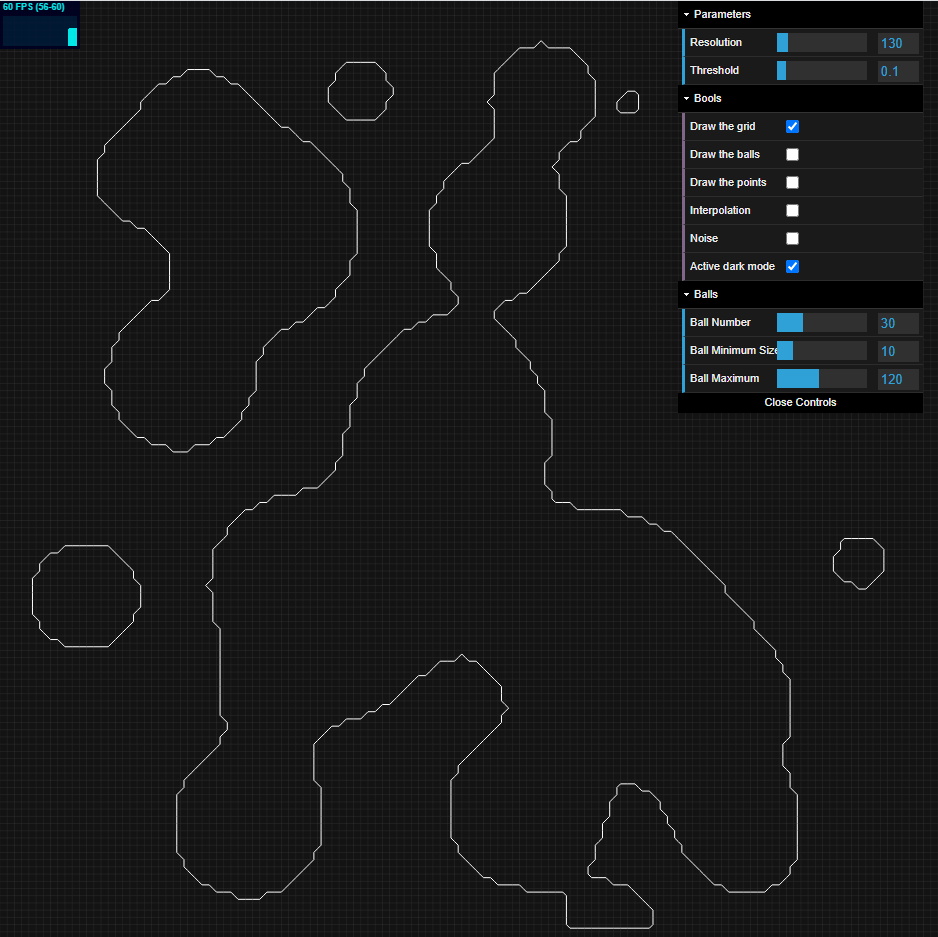
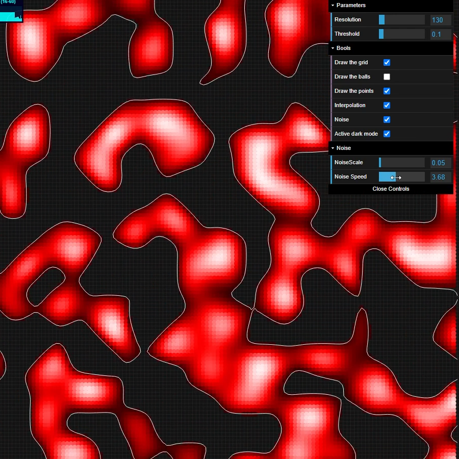
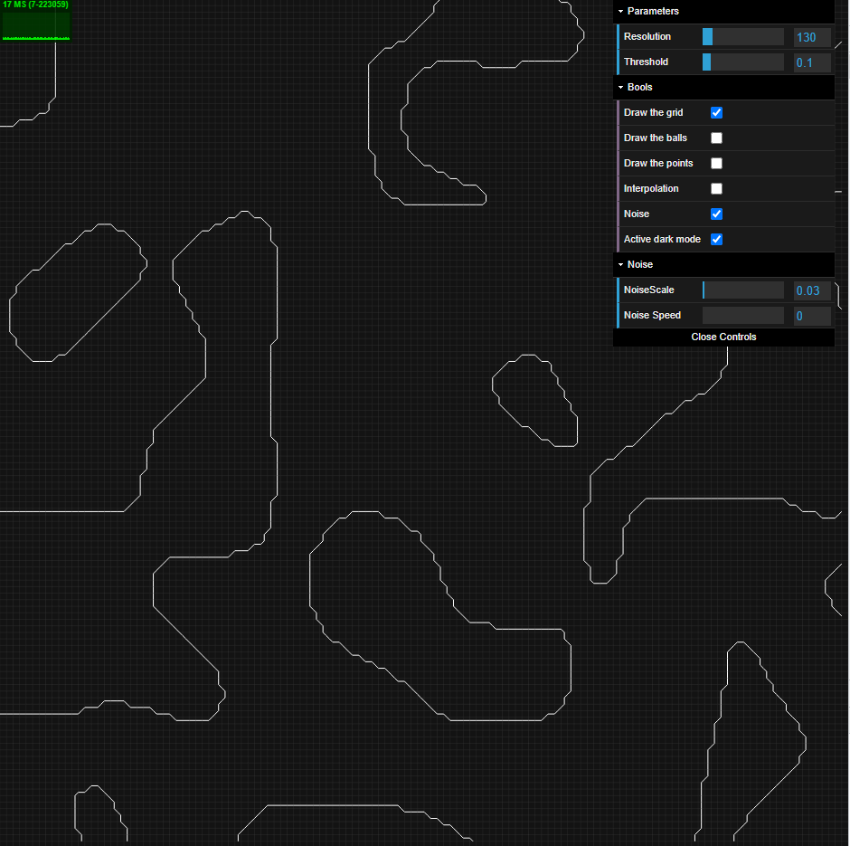

# Marching-Squares
Create contour using Marching Square and interpolation, the movement is done with bouncing ball and average distance calculation
2D version of the Marching Cubes algorithm

Interface            
:-------------------------:
    

## Build With

Any additional information goes here

- JavaScript
    - Simplex Noise
    - JQuery
    - DatGui
    - StatsJS
- Html
- CSS

## Screenshots

Example #1                         |  Example #2                        
:---------------------------------:|:----------------------------------:
         | 
Noise with color and interpolation | Noise without color and interpolation

## Demo

Demonstration gifs
Gif #1                     |  Gif #2                   |  Gif #3     
:-------------------------:|:-------------------------:|:-------------------------:
       |       |  

 

